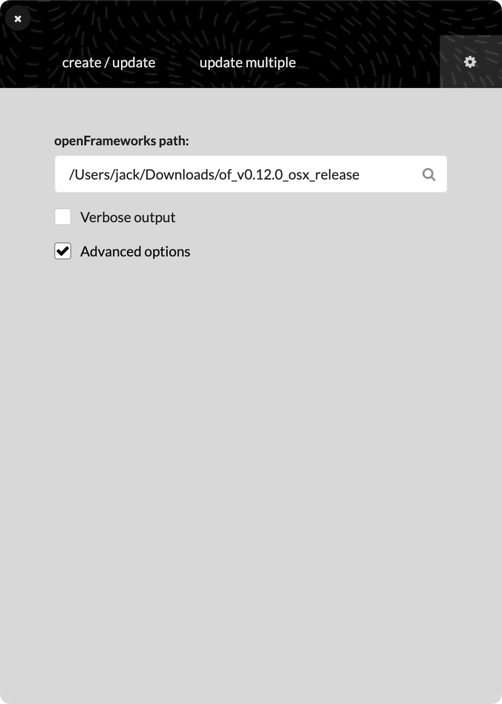
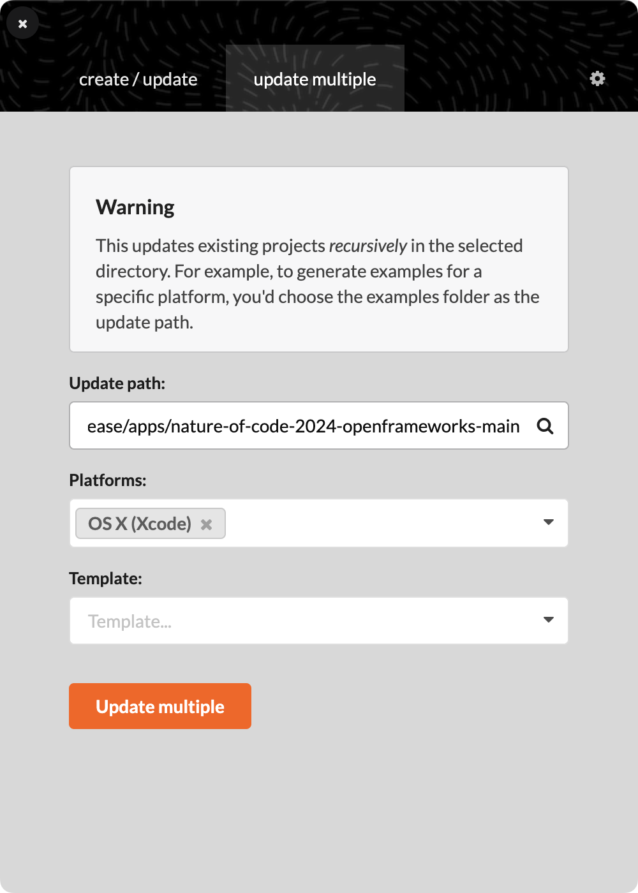

# The Nature of Code (2024 Edition): Code Examples in C++ (openFrameworks)

This repository is a collection of C++ ([openFrameworks](https://openframeworks.cc/)) code examples for **Daniel Shiffman**'s book [_the Nature of Code (2024 Edition)_](https://natureofcode.com/), ported from his [original code examples](https://natureofcode.com/examples/) written in JavaScript ([p5.js](https://p5js.org/)).

## How do I run these examples?

1. Download openFrameworks v0.12.0 for your desired platform (e.g. `osx` for macOS) from the [openFrameworks download page](https://openframeworks.cc/download/) and unzip it. You should see a folder titled `of_v0.12.0_platform_release/` (e.g. `of_v0.12.0_osx_release/` for macOS).
2. [Download this repository](https://github.com/jackbdu/nature-of-code-2024-openframeworks/archive/refs/heads/main.zip), unzip it, and place the extracted folder (`nature-of-code-2024-openframeworks-main/`) into the `of_v0.12.0_platform_release/apps/` folder.

|  |  |
| ------------------------------------------------------------- | ------------------------------------------------------------ |

4. In the _projectGenerator_ app, go to the _update multiple_ tab. Under _Update path_, click the magnifying glass icon :mag: and open the repository folder (`nature-of-code-2024-openframeworks-main/`) from there, then Click the _Update multiple_ button.

5. Finally, open any code example (e.g. `Example_0_1_Random_Walk/`) in your preferred IDE to compile and run.

_For additional guides, you can refer to the [openFrameworks learning page](https://openframeworks.cc/learning/)._

## License

The code examples in this repository are licensed under the [MIT License](LICENSE). For copyright information of the Nature of Code book, please refer to the [Nature of Code Credits page](https://natureofcode.com/credits/).
